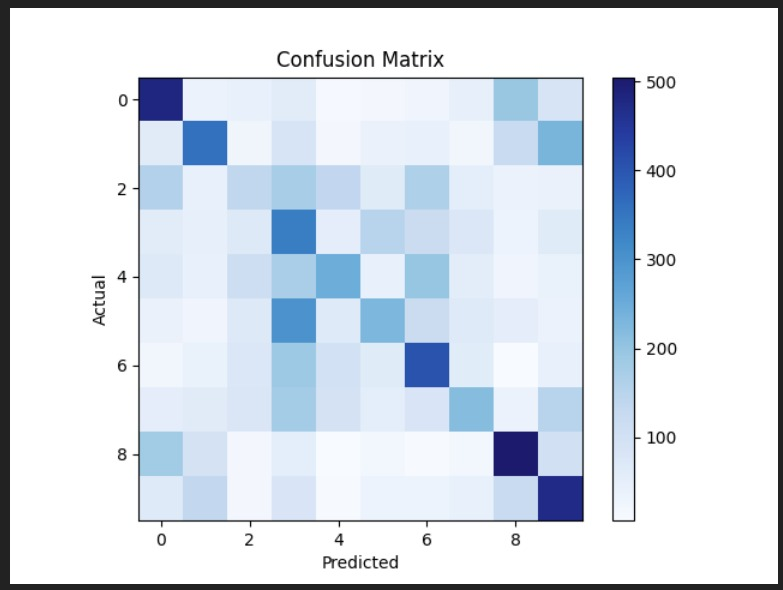
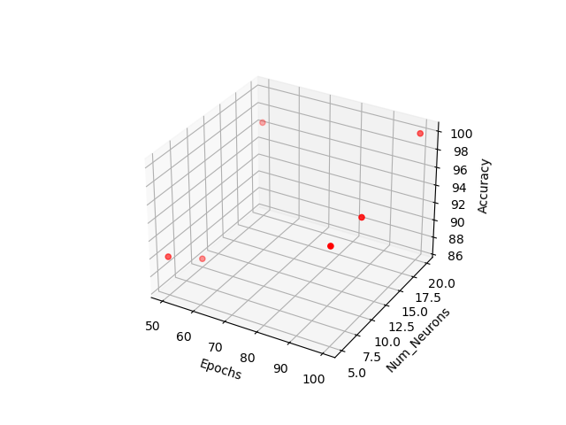
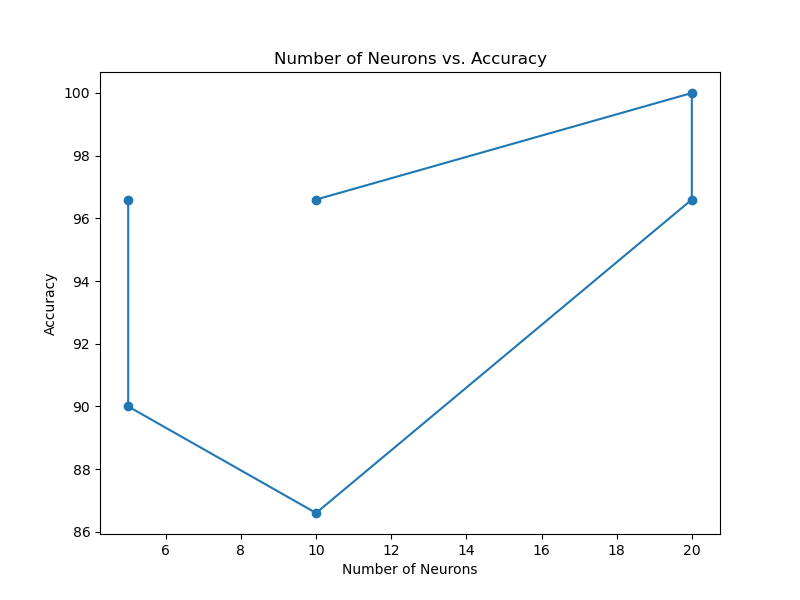
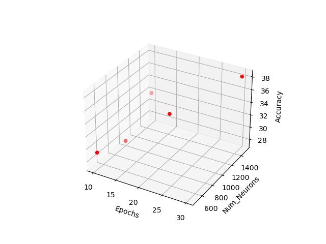
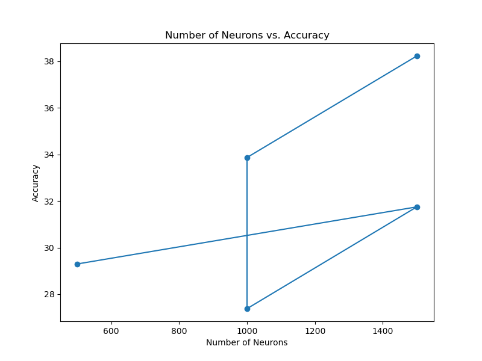

## LAB: 10
#### Team
- Sanskriti Singh [ 2001CS60 ]
- Rupak Biswas [ 2001CS57 ]
---
### How to run ?
```
python assign1.py
```
- Run above command in the terminal
- It will :
    - train the model on XOR dataset
    - Give predictions on the test dataset
    - Statistics of the prediction on the test data
```
python assign2_cifer.py
```
- Run above command in the terminal
- It will :
    - train the model on CIFAR10 dataset
    - Give predictions on the test dataset
    - Statistics of the prediction on the test data
```
python assign2_iris.py
```
- Run above command in the terminal
- It will :
    - train the model on IRIS dataset
    - Give predictions on the test dataset
    - Statistics of the prediction on the test data

## Problem Statement:
1. Design and implement an artificial neural network to simulate a 2-input XOR gate.
Assign appropriate values to weights and thresholds to edges and nodes in the neural
network.
Note: Do not use any DL library (Keras, PyTorch, etc.) to implement the XOR gate
2. Go through the attached IRIS and CIFAR-10 datasets and design a Multi-Layer
Perceptron (MLP) classifier. Train the feedforward networks using the given datasetsand show the evaluation in terms of precision, recall, f-score, and accuracy. Experiment
with the number of neurons in the hidden layer and plot an accuracy v/s number of
neurons graph.
3. (Divide the data into train and validation sets, having 80% of each class in the train and
rest for the validation). Report the validation performances.

### Datasets
For both datasets, use ReLU and leaky ReLU activation functions and check which one
is giving high performance.
Note: You can use any DL library to implement the MLP
Data Sets: 
- IRIS: https://archive.ics.uci.edu/dataset/53/iris
- CIFAR-10: ​https://www.cs.toronto.edu/~kriz/cifar.html


## Analysis

### Training

- We ran the model on each dataset
- used different combinations of the 
    - number of epochs and 
    - number of nuerons in the hidden layers

### Testing

- The models was tested on the respective test set.
- Statistics for the predictions was calculated and plotted

## Results

- Confusion matrix


- Num_neurons VS Num_epochs VS Accuracy : IRIS


- Num_neurons VS Accuracy : IRIS


- Num_neurons VS Num_epochs VS Accuracy : CIFAR10


- Num_neurons VS Accuracy : CIFAR10



