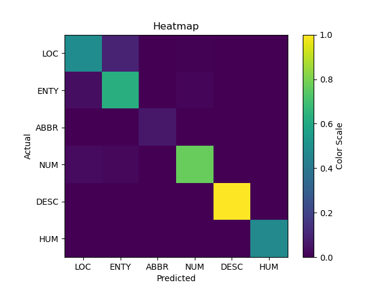
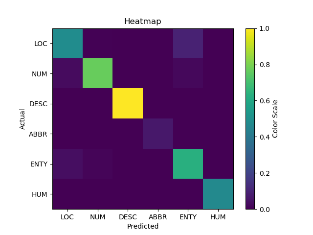
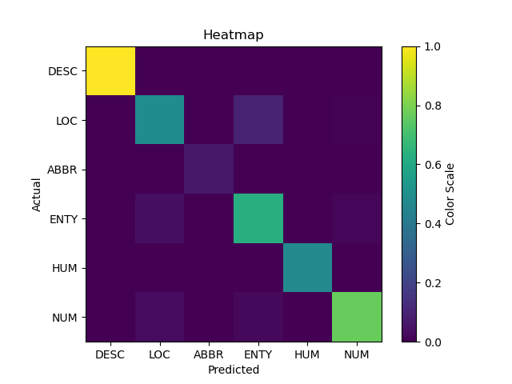

## LAB: 5
#### Team
- Sanskriti Singh [ 2001CS60 ]
- Rupak Biswas [ 2001CS57 ]
---
### How to run ?
```python
if __name__== '__main__':
    # load dataset and extract feature
    l = Loader(path + "datasets")
    ngrams = NGram(3, l, [500,300,200])
    l._extract_features(ngrams.grams, 3)
    l._extract_features_test(ngrams.grams, 3)
    
    # gini, entropy, misclass
    tree = DecisionTree('misclass')
    # tree.fit(l)
    # tree.save("DT_misclass.pkl")
    tree.load("DT_misclass.pkl")
    # tree.display(tree.root)
    tree.test(l)
```
- `Loader`: to load data
- `Loader.extract_features`: to extract features
- `DecisionTree.fit`: to train model
- `DecisionTree.save`: to save model
- `DecisionTree.load`: to load saved model
- `DecisionTree.test`: to evaluate model

## Problem Statement

- Write a Python program that implements Question classification using Decision Tree
classifier.
- Features:
    - (a) Length of the question
    - (b) Lexical Features: Word n-gram.
    - (c) Syntactic Features: Parts of speech tag unigrams
- Implement n-gram ( n=1,2 and 3) features for each question instance. 
- You may choose only the most frequent n-grams to provide as a feature for your model.
- For n=1, use 500 most frequent 1-gram, similarly use 300 and 200 most frequent n-grams, for n=2 and 3 respectively. 
- For parts of speech tag unigrams, first you need to get a POS tag for each question instance. Similar  to lexical features use 500 most frequent 1-gram to build the model.


## Results

### GINI

#### Confusion matrix


#### Scoring
```
LOC : precision 0.8271604938271604, recall 0.881578947368421, f1 score 0.8535031847133757
ENTY : precision 0.925531914893617, recall 0.8446601941747574, f1 score 0.8832487309644671
ABBR : precision 1.0, recall 1.0, f1 score 1.0
NUM : precision 0.9380530973451328, recall 0.9724770642201835, f1 score 0.954954954954955
DESC : precision 1.0, recall 1.0, f1 score 1.0
HUM : precision 1.0, recall 1.0, f1 score 1.0
```

### Misclassification

#### Confusion matrix


#### Scoring
```
LOC : precision 0.8271604938271606, recall 0.881578947368421, f1 score 0.8535031847133759
NUM : precision 0.9380530973451328, recall 0.9724770642201835, f1 score 0.954954954954955
DESC : precision 1.0, recall 1.0, f1 score 1.0
ABBR : precision 1.0, recall 1.0, f1 score 1.0
ENTY : precision 0.925531914893617, recall 0.8446601941747574, f1 score 0.8832487309644671
HUM : precision 1.0, recall 1.0, f1 score 1.0
```

### Entropy

#### Confusion matrix


#### Scoring
```
DESC : precision 1.0, recall 1.0, f1 score 1.0
LOC : precision 0.8271604938271604, recall 0.881578947368421, f1 score 0.8535031847133757
ABBR : precision 1.0, recall 1.0, f1 score 1.0
ENTY : precision 0.925531914893617, recall 0.8446601941747574, f1 score 0.8832487309644671
HUM : precision 1.0, recall 1.0, f1 score 1.0
NUM : precision 0.9380530973451328, recall 0.9724770642201835, f1 score 0.954954954954955
```