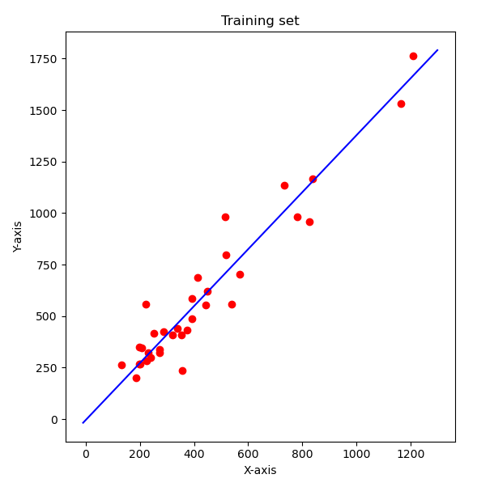
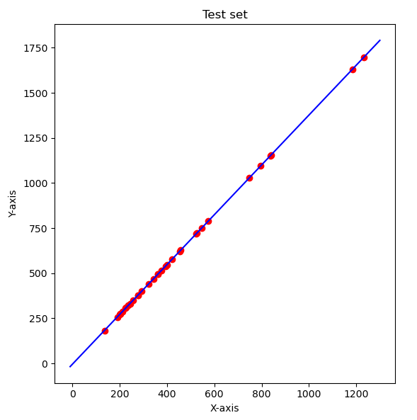

## LAB: 6
#### Team
- Sanskriti Singh [ 2001CS60 ]
- Rupak Biswas [ 2001CS57 ]
---
### How to run ?
```
python main.py
```
- Run above command in the terminal
- It will generate:
    - Linear regression plot on train data
    - Prediction plot on test data
    - Statistics of the prediction on the Test data

## Problem Statement

- The newspaper companies circulate special Sunday editions along with their daily editions. However, all these companies want to investigate the feasibility of these Sunday editions for the next week based on the sales from current week sales. The objective is to predict which newspaper companies should stop their Sunday edition if the predicted Sunday circulation should be at least more than 30% of their daily sales.
    - For example if the no. of daily newspapers is 100 then that newspaper company can circulate their Sunday edition if the predicted no. of Sunday newspapers is more than 130
    - Since the sale of daily newspapers for the next week is unknown, consider three cases; minimum, maximum and average no. of newspapers sold from the entire dataset.
    - The task is to create a simple statistical model to predict the companies that should not circulate their Sunday edition


## Analysis

### Linear Regression

- hypothesis used is:
    ```
    y = theta1*x + theta2
    ```

    - where: `theta1` is:
        ```
        theta1 = Cov(x, y) / Var(x)
        ```
    - and `theta2` is:
        ```
        theta2 = Mean(y) - theta1 * Mean(x)
        ```
### Plot



## Testing

- The regression model was tested to predict outcome of the given test data.
### Plot



## Results

- For test data, all newspapers were eligible to continue their Sunday Edition as all Sunday circulations were more than 30% of the Daily editions

- Stats for the Sunday circulation prediction percentage with respect to Daily circulation: 
    - average_percentage :  136.91032215649275
    - minimum_percentage :  135.32100386197106
    - Maximum_percentage :  137.73401117238376


