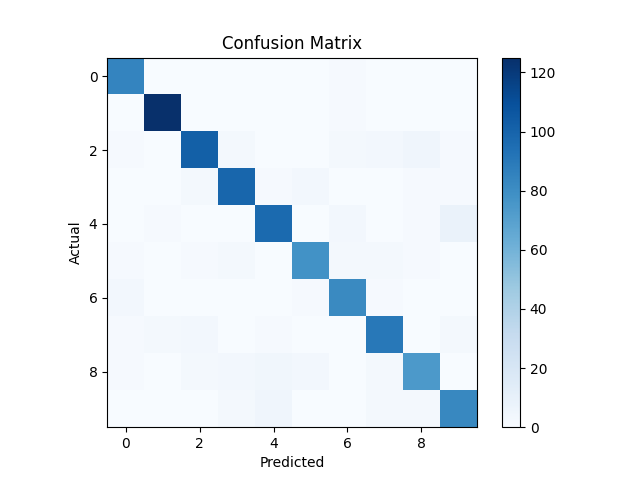

## LAB: 8
#### Team
- Sanskriti Singh [ 2001CS60 ]
- Rupak Biswas [ 2001CS57 ]
---
### How to run ?
```
python main.py
```
- Run above command in the terminal
- It will :
    - train the model
    - Statistics of the prediction on the test data

## Problem Statement:
- The MNIST dataset is a database of handwritten digits. The task is to classify the given handwritten digit into one of the 10 digits (0 to 9)
### Dataset
- mnist_train.csv contains 60,000 instances and mnist_test.csv contains 10,000 instances with 785 features including the label (the digit the input corresponds to). The original dataset contains the handwritten digits in image format (28x28). In the given dataset, the images are already flattened in a single row (that’s why each input will contain 784 features and one target digit that input
corresponds to)
### Task
Given the input data, the logistic regression classifier has to classify the given data into one of the digit (from 0 to 9)


## Analysis

### Logistic Regression

- hypothesis used is:
    - 

- where: `g` is the sigmoid function
    - 

### Training

We ran the model with `epochs = 100` and `lr = 0.001`.

```
26/30, error=0.014548
100%|███████████████████████████████████████████████████████████████████████████████████████████| 60000/60000 [00:02<00:00, 23717.83it/s]
27/30, error=0.014515
100%|███████████████████████████████████████████████████████████████████████████████████████████| 60000/60000 [00:02<00:00, 23690.67it/s]
28/30, error=0.014484
100%|███████████████████████████████████████████████████████████████████████████████████████████| 60000/60000 [00:02<00:00, 23727.27it/s]
29/30, error=0.014455
100%|███████████████████████████████████████████████████████████████████████████████████████████| 60000/60000 [00:02<00:00, 23681.92it/s]
30/30, error=0.014427
Evaluating...
...

```

## Testing

- The regression model was tested to predict the labels of the given test data.

### Plot



### Results

- Accuracy: 91.4%


